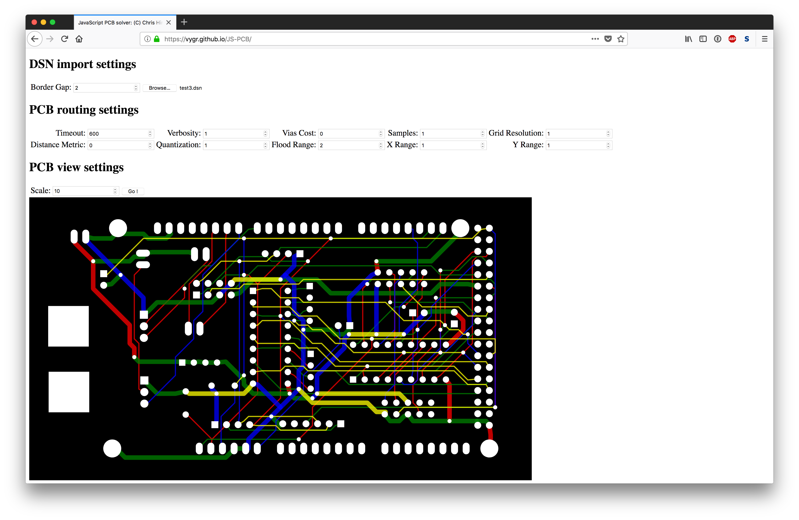

# JS-PCB



## JavaScript PCB router and solver.

Uses JS6 features so you need an up to date browser ! Known to work in Chrome
and Firefox on OSX.

assume all nets are two pin net

Format of PCB data is:

```
NODE_2D		[x, y]
NODE_3D		[x, y, z]
SHAPE		[NODE_2D, ...]
PATH		[NODE_3D, ...]
PATHS		[PATH, ...]
TERMINAL	[terminal_radius, terminal_gap, NODE_3D, SHAPE]
TERMINALS	[TERMINAL, ...]
TRACK		[track_radius, via_radius, track_gap, TERMINALS, PATHS]
TRACKS		[TRACK, ...]
PCB		{dims: [width, height, depth], tracks: TRACKS}
```

SHAPE can be empty, [], and this means a circular pad. Two points means an oval
pad, otherwise the polygon shape of the pad.

PATHS can be empty, [], this means no paths. If paths are empty on the input to
the solver it means that this track needs solving, else the paths given
represent protected wiring/paths and are to be routed around.

You can download the .dsn files and run the app by simply going to https://vygr.github.io/JS-PCB
